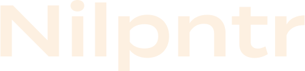

Hi, My name is Sam Mobach, a software engineer, frontend developer and mobile developer. Mostly programming in Go! I care a lot about scalability and that's why I always use Kubernetes!

Since 2015 I work as a freelancer next to my study. Most of my projects are related to microservices, cloud, container orchestration like Kubernetes, websites and apps.

If you're interested in my work/projects please contact me. [Mail](mailto:hello@sammobach.com)
